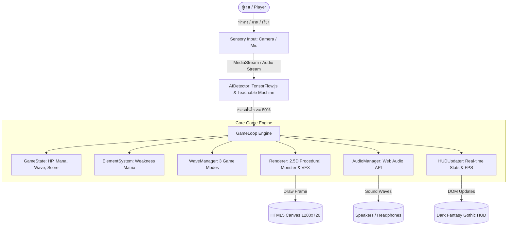

# 🧙 Elemental Spell Caster — เอกสารสรุปสเปคและหลักการทำงานของระบบ (System Specification & Architecture)

---

## 1. ภาพรวมของโปรแกรม (Project Overview)
**Elemental Spell Caster** เป็นเกมแนว **Arcane Action Spellcasting** ที่ผสานเทคโนโลยี **AI/Machine Learning (Google Teachable Machine)** เข้ากับการเรนเดอร์กราฟิก **HTML5 Canvas 2.5D Procedural Concept Art** และเสียงสังเคราะห์ **Web Audio API** ในรูปแบบ Single-Page Web Application โดยไม่ต้องติดตั้งโปรแกรมเสริมหรือใช้ Build Tools ใดๆ สามารถเปิดเล่นผ่านเว็บเบราว์เซอร์ได้ทันที

---

## 2. ข้อมูลจำเพาะทางเทคนิค (Technical Specifications)

| หัวข้อ | รายละเอียด |
| :--- | :--- |
| **สถาปัตยกรรม** | Single-Page Application (SPA) / Client-Side 100% |
| **ภาษาหลัก** | HTML5, CSS3 (Modern Flexbox/Grid, SVG Animations), JavaScript (ES6+ Classes) |
| **AI / Machine Learning** | TensorFlow.js v1.3.1, `@teachablemachine/pose`, `@teachablemachine/image`, `@tensorflow-models/speech-commands` |
| **Graphics Engine** | HTML5 2D Canvas Engine (ความละเอียด Base: 1280 × 720 HD) พร้อม Hardware Acceleration |
| **Audio Engine** | Procedural Audio Synthesis ด้วย Web Audio API (OscillatorNode, GainNode, BiquadFilterNode) |
| **FPS Target** | 60 FPS Real-time Frame Pacing พร้อมตัวตรวจวัดค่า FPS ภายในเกม |
| **การเชื่อมต่ออุปกรณ์** | WebRTC `navigator.mediaDevices.getUserMedia` (Webcam & Microphone) |
| **แพลตฟอร์มที่รองรับ** | Google Chrome, Microsoft Edge, Mozilla Firefox, Safari (Modern Desktop/Laptop Browsers) |

---

## 3. สถาปัตยกรรมและโมดูลหลักของระบบ (Core Architecture & Modules)



---

### 3.1 โมดูลปัญญาประดิษฐ์ (AIDetector Module)
ทำหน้าที่เชื่อมต่อกับโมเดล Google Teachable Machine และประมวลผลอินพุตแบบ Real-time:

1. **รองรับประเภทโมเดล 3 รูปแบบ (Sensory Inputs)**:
   * **Pose Model (`tmPose`)**: ตรวจจับโครงร่างกระดูกร่างกาย (Skeleton Keypoints)
   * **Image Model (`tmImage`)**: จำแนกภาพสัญลักษณ์ วัตถุ หรือท่าทางผ่านกล้องเว็บแคม
   * **Audio Model (`speechCommands`)**: ตรวจจับเสียงร่ายมนตร์ผ่านคลื่นเสียงความถี่ Browser FFT
2. **ระบบตรวจสอบและรองรับโมเดลแบบยืดหยุ่น (Flexible Model Validation)**:
   * ดึง Metadata รายชื่อคลาสทั้งหมดจากโมเดล (`metadata.json` / `getClassLabels()` / `wordLabels()`)
   * **เงื่อนไขบังคับ 1 (Mandatory Idle)**: โมเดล **ต้องมีคลาสสถานะพัก (Idle)** อย่างน้อย 1 คลาส (เช่น `Idle`, `Rest`, `Stand`, `None`) เพื่อให้ระบบตรวจจับจังหวะการหยุดร่ายเวทได้
   * **เงื่อนไขบังคับ 2 (Min 3 Elements)**: โมเดล **ต้องมีคลาสธาตุอย่างน้อย 3 ธาตุขึ้นไป** (รวมทั้งหมดอย่างน้อย 4 Classes: 3 ธาตุ + 1 Idle)
3. **ระบบจัดการคำพ้องและความผิดพลาดของ Label (`_normalizeLabel`)**:
   * แปลงคำผิดและรูปแบบต่างๆ เช่น `idel`, `ibel`, `idie`, `stand`, `wait`, `rest` ➜ **`Idle`** อย่างแม่นยำ
   * แปลงชื่อธาตุภาษาอังกฤษและคำพ้อง ➜ `Fire`, `Water`, `Earth`, `Wind`, `Lightning`, `Ice`
4. **ระบบล็อคธาตุอัตโนมัติ (Element Locking System)**:
   * ธาตุใดที่ผู้เล่นไม่ได้ฝึกในโมเดล AI จะถูกตั้งสถานะเป็น `locked`
   * การ์ดเวทด้านล่างและแถบตรวจจับจะขึ้นป้าย `🔒 LOCKED` และป้องกันการร่ายเวททั้งจาก AI และการกดปุ่ม

---

### 3.2 ระบบธาตุและการคำนวณความเสียหาย (ElementSystem & Weakness Matrix)
ระบบธาตุ 6 สายตามหลักวงจรแพ้-ชนะทาง (Circular Hexagonal Weakness Cycle):

```
       [ICE (น้ำแข็ง)]
       ↙             ↖
[WIND (ลม)]          [FIRE (ไฟ)]
    ↓                     ↑
[WATER (น้ำ)]         [LIGHTNING (สายฟ้า)]
       ↘             ↗
       [EARTH (ดิน)]
```

| ธาตุผู้ร่าย (Spell) | ชนะทาง (Super Effective: 2.0x) | แพ้ทาง (Resistant: 0.5x) | ธาตุอื่น (Normal: 1.0x) |
| :--- | :--- | :--- | :--- |
| **Fire (ไฟ)** | ❄️ Ice | 💧 Water | ⚡ Lightning, 🌿 Earth, 💨 Wind |
| **Ice (น้ำแข็ง)** | 💨 Wind | 🔥 Fire | 💧 Water, ⚡ Lightning, 🌿 Earth |
| **Wind (ลม)** | 💧 Water | ❄️ Ice | 🔥 Fire, ⚡ Lightning, 🌿 Earth |
| **Water (น้ำ)** | 🌿 Earth | 💨 Wind | 🔥 Fire, ❄️ Ice, ⚡ Lightning |
| **Earth (ดิน)** | ⚡ Lightning | 💧 Water | 🔥 Fire, ❄️ Ice, 💨 Wind |
| **Lightning (สายฟ้า)** | 🔥 Fire | 🌿 Earth | 💧 Water, ❄️ Ice, 💨 Wind |

---

### 3.3 โมเดลมอนสเตอร์ 2.5D Concept Art (Procedural Volumetric Rendering)
สร้างภาพมอนสเตอร์ระดับคุณภาพสูงแบบสดๆ ผ่าน Canvas API โดยไม่ใช้รูปภาพ Sprite 2D แบนๆ:

* **เทคนิคที่ใช้**:
  1. **Volumetric Shading**: ใช้ `createRadialGradient` และ `createLinearGradient` ซ้อนกันหลายชั้นเพื่อสร้างความหนาและมวลสาร 3 มิติ
  2. **Specular Highlights & Rim Light**: แสงสะท้อนขอบวัตถุและประกายตามพื้นผิว
  3. **Ambient Occlusion**: เงาตกกระทบใต้ลำตัวและข้อต่อ
  4. **Micro-Texturing**: การจุดเกร็ดหิน (Granite Stippling), เส้นใยขนสัตว์ (Feather Barbs), และรอยแยกพลังงาน (Magma Fissures)
  5. **Organic Breathing Animation**: มอนสเตอร์ขยับหายใจ กางปีก หมุนลูกแก้วเวท และปล่อยละอองเวทมนตร์แบบ Real-time
* **รายชื่อมอนสเตอร์ประจำธาตุ**:
  1. **Earth**: *Granite Titan* (ไททันหินผาพร้อมรอยแยกแกนทองคำ)
  2. **Fire**: *Inferno Arch-Demon* (จอมมารลาวาเพลิงพร้อมเขากระทิงออบซิเดียนและปีกมังกร)
  3. **Lightning**: *Thunder Gargoyle* (การ์กอยล์สายฟ้าพร้อมสายฟ้าฟาด Fractal แตกแขนง)
  4. **Water**: *Abyssal Wraith* (ภูตวิญญาณแห่งห้วงสมุทรลึกพร้อมลูกแก้วน้ำวน 3D)
  5. **Wind**: *Zephyr Harpy* (ฮาร์ปีวายุพร้อมพายุไซโคลนและปีกเคียวลมสังหาร)
  6. **Ice**: *Glacial Behemoth* (อสูรน้ำแข็งโบราณพร้อมเขาคริสตัลหักเหแสง)

---

### 3.4 ระบบเสียงสังเคราะห์ (AudioManager Module - Procedural Web Audio API)
ระบบเสียงทำงานผ่าน Web Audio API โดยไม่ต้องดาวน์โหลดไฟล์เสียงภายนอก:
* **Spell SFX**: สังเคราะห์โทนเสียงตามคุณสมบัติธาตุ (เช่น Fire ใช้ White Noise + Lowpass sweep, Lightning ใช้ Sawtooth Frequency Modulation, Ice ใช้ Sine Chime)
* **Hit & Impact SFX**: เสียงกระทบเนื้อ/เกราะตามธาตุของมอนสเตอร์
* **Monster Death SFX**: เสียงสลายตัวของมอนสเตอร์พร้อมเบส Deep Drop
* **Dynamic BGM Engine**: สร้างเสียงสังเคราะห์บรรยากาศดนตรี Dark Gothic Drone & Arpeggio ในลูปอย่างต่อเนื่อง

---

### 3.5 โหมดการเล่น (Game Modes)
1. **Wave Survival (Standard)**:
   * ผจญภัยเอาชีวิตรอด 20 เวฟ
   * ความยากและจำนวนมอนสเตอร์จะไต่ระดับขึ้น มีมอนสเตอร์ระดับ Normal, Elite และ Boss ประจำเวฟ
2. **Endless Crucible (Hardcore)**:
   * เวฟไร้ที่สิ้นสุด (Infinite Waves) ทดสอบขีดจำกัดความเร็วและพลังมานา
   * ระบบคิดคะแนนสะสม High Score Leaderboard
3. **Realm Conquest (Campaign)**:
   * ตะลุย 7 วิหารธาตุศักดิ์สิทธิ์ (Ice, Fire, Lightning, Earth, Water, Wind และ All-Elements Void Sanctum)
   * แต่ละด่านมีบอสประจำธาตุสุดโหดที่ต้องใช้การแก้ทางธาตุเฉพาะตัว

---

### 3.6 ระบบหน้าจอและอินเทอร์เฟซ (UI & HUD System)

#### หน้าเมนูหลัก (Dark Fantasy Gothic Arcane Sanctum)
* **Grand Sanctum Seal**: ตราประทับเวทมนตร์และดาว 6 แฉกหมุนวน
* **Multi-Layer Magic Circle Array**: วงเวทมนตร์โบราณหมุนสวนทางกัน 4 ชั้นที่ฉากหลัง
* **Flowing Ley-Line Streams**: ลำแสงพลังงานเวทมนตร์วิ่งวนรอบกรอบหน้าจอ 4 ด้าน
* **Ambient Magic Embers (MenuParticleSystem)**: สะเก็ดละอองเวทมนตร์ลอยเอื่อยๆ นุ่มนวล เปล่งประกายทอง ไซอัน และไวโอเล็ตที่ฉากหลังหน้าเมนู
* **Custom SVG Icons**: แทนที่อีโมจิด้วยเวกเตอร์ไอคอนเฉพาะตัว (Pose Sigil, Mystic Eye, Soundwave Rune, Shields & Grimoires)

#### แถบสถานะภายในเกม (In-Game Top HUD)
* **Safe Insets Layout**: ขยายระยะขอบด้านข้าง ไม่ถูกกรอบมุมจอหรือเส้นแสงบังข้อมูล
* **HP Health Bar**: แถบหลอดเลือดสีแดงทับทิม บอกตัวเลขและเปอร์เซ็นต์เลือด พร้อมไฟเตือนเมื่อเลือดต่ำกว่า 30%
* **Mana Bar**: แถบหลอดมานาสีฟ้าไซอัน บอกตัวเลขและเปอร์เซ็นต์มานา พร้อมเอฟเฟกต์แสงวิ่ง (Flowing Shimmer)
* **Mini FPS Counter**: ป้ายบอกสถานะเฟรมเรต Real-time ขนาดกะทัดรัด
* **Crosshair & Spell Deck**: การ์ดเวทมนตร์ 6 ธาตุด้านล่างพร้อมไฮไลต์ธาตุที่ตรวจจับได้แบบ Real-time

---

## 4. โครงสร้างไฟล์โปรเจกต์ (Project File Structure)

```
elemental-spell-caster/
├── index.html                  # โครงสร้าง DOM, หน้าเมนู, หน้าเกม, Overlays และ SVG Sigils
├── style.css                   # สไตล์ Dark Fantasy, Keyframe Animations, และ Grid Layout
├── game.js                     # โค้ดหลัก: GameEngine, AIDetector, Renderer 2.5D, Audio, UI Wiring
├── SYSTEM_SPECIFICATION.md     # เอกสารสรุปสเปคและหลักการทำงานของระบบ (เอกสารฉบับนี้)
└── assets/
    └── images/                 # ภาพประกอบพื้นหลังวิหารและการ์ดเวทมนตร์
        ├── bg_cathedral.jpg
        ├── spell_fire.jpg
        ├── spell_water.jpg
        ├── spell_earth.jpg
        ├── spell_wind.jpg
        ├── spell_lightning.jpg
        └── spell_ice.jpg
```

---

## 5. การควบคุมและคีย์ลัด (Controls & Keybindings)

> [!NOTE]
> **ระบบความปลอดภัยและการควบคุม**: โดยค่าเริ่มต้นในโหมด AI ปกติ ผู้เล่นจะต้องควบคุมผ่านท่าทาง/ภาพ/เสียงเท่านั้น การกดคีย์บอร์ด 1-6 และการคลิกการ์ดจะถูกล็อคไว้ หากต้องการเปิดใช้งานคีย์บอร์ดและคลิกการ์ดเพื่อทดสอบ ให้พิมพ์ **Cheat Code** (เช่น `cheat`, `debug`, `dev`, `keyboard`, `manual`) ในช่อง Model URL ที่หน้าแรก

| การกระทำ | วิธีการควบคุมด้วย AI (ค่าเริ่มต้น) | วิธีการควบคุมด้วยแป้นพิมพ์ / เมาส์ (เมื่อใส่ Cheat Code) |
| :--- | :--- | :--- |
| **ร่ายเวท Ice** | ทำท่าทาง / แสดงภาพ / พูดคลาส `Ice` ($\ge 80\%$ Conf) | คลิกการ์ด Frost Lance หรือกดแป้นตัวเลข **`1`** |
| **ร่ายเวท Fire** | ทำท่าทาง / แสดงภาพ / พูดคลาส `Fire` ($\ge 80\%$ Conf) | คลิกการ์ด Phoenix Burst หรือกดแป้นตัวเลข **`2`** |
| **ร่ายเวท Lightning** | ทำท่าทาง / แสดงภาพ / พูดคลาส `Lightning` ($\ge 80\%$ Conf) | คลิกการ์ด Volt Chain หรือกดแป้นตัวเลข **`3`** |
| **ร่ายเวท Earth** | ทำท่าทาง / แสดงภาพ / พูดคลาส `Earth` ($\ge 80\%$ Conf) | คลิกการ์ด Terra Fist หรือกดแป้นตัวเลข **`4`** |
| **ร่ายเวท Water** | ทำท่าทาง / แสดงภาพ / พูดคลาส `Water` ($\ge 80\%$ Conf) | คลิกการ์ด Tidal Surge หรือกดแป้นตัวเลข **`5`** |
| **ร่ายเวท Wind** | ทำท่าทาง / แสดงภาพ / พูดคลาส `Wind` ($\ge 80\%$ Conf) | คลิกการ์ด Gale Strike หรือกดแป้นตัวเลข **`6`** |
| **หยุดพัก / ชะลอเวท** | อยู่ในท่าทางพัก / เงียบเสียง / ปล่อยว่าง (`Idle`) | — |
| **หยุดเกมชั่วคราว (Pause)** | — | คลิกปุ่ม `⏸` หรือกดแป้น **`Escape`** |

---

## 6. สรุปความพร้อมและมาตรฐานของระบบ (Quality & Standards)
* ✅ **Zero External Build Step**: ใช้งานได้ทันทีโดยไม่ต้องรัน `npm install` หรือ `webpack/vite`
* ✅ **Clean Syntax Validated**: ผ่านการตรวจสอบความถูกต้องด้วย `node --check game.js` 100% ปราศจาก Syntax Error
* ✅ **High Accessibility**: รองรับทั้งผู้เล่นที่มีกล้อง/ไมค์ และผู้เล่นที่ต้องการเล่นผ่านคีย์บอร์ด/เมาส์
